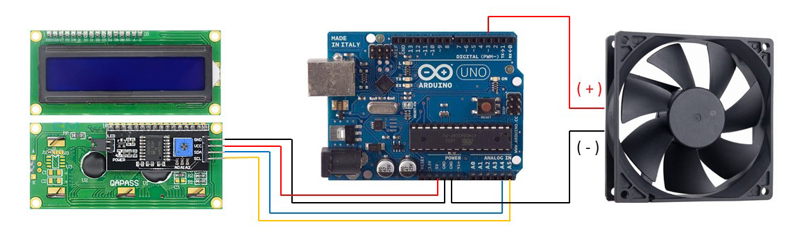

# Face Counting and Fan Speed Control System (PWM-Adjust-People-Counting)

## Overview

This project involves a face detection system using OpenCV in Python to count the number of people detected in a video stream. Based on the count, the system communicates with an Arduino, adjusting the fan speed according to the number of detected faces.

## Schematic:

<br/>

## Description:

Control fan motor speed (PWM) based on number of people detected by camera

## Project Structure

- facecounting.py: A Python script that uses OpenCV for face detection and sends signals to an Arduino to adjust the fan speed.
- PWM_Adjust.ino: An Arduino script that adjusts the fan speed based on the signal received from the Python script.

## Software Required:

- IDE Arduino 1.8.3
- Python 3.8.5
- PIP 20.2.2
- OpenCV 4.3.0
- pySerial 3.4
- Numpy 1.19.1

## Hardware Required:

- Laptop/PC
- Webcam
- Arduino Uno Board
- Cooling Fan 12V DC
- LCD I2C
- Jumper Wires
- USB Cable

## Dependencies

Python Script Dependencies (facecounting.py):

- OpenCV: To install, run pip install opencv-python
- Numpy: To install, run pip install numpy
- PySerial: To install, run pip install pyserial

## Arduino Code (PWM_Adjust.ino):

- Arduino IDE: Download from here.
- Arduino LiquidCrystal I2C Library: To install, go to Sketch > Include Library > Manage Libraries in the Arduino IDE and search for "LiquidCrystal I2C".

## Setup Instructions

### **Hardware Requirements:**

1. Arduino Uno or any other compatible Arduino board.
2. USB cable to connect the Arduino to your computer.
3. Fan (PWM-compatible) connected to the appropriate pin on the Arduino (in this case, pin 3).
4. LCD display with I2C communication connected to the Arduino.

### **Software Setup:**

1. Face Detection:

   - The Python script uses OpenCV’s Haar Cascade for face detection. Ensure that the haarcascade_frontalface_default.xml file is in the same directory as facecounting.py.
   - The Python script reads from your computer's webcam (VideoCapture(0)).

2. Arduino Communication:
   - The Python script sends data to the Arduino through a serial port (e.g., COM4 in the example code). You need to change 'COM4' to the appropriate serial port for your system.

## Python Script: Face Detection (facecounting.py)

This script continuously captures video from the webcam, detects faces in real-time, and sends a signal to the Arduino to control the fan speed based on the number of faces detected.
Face Counting Logic:

- 1-2 faces: Low speed (L)
- 3-6 faces: Medium speed (M)
- 7+ faces: High speed (H)
- 0 faces: Fan is off (S)

Running the Python Script:

1. Connect the Arduino to your computer.
2. Ensure the correct serial port is used in the Python script (COM4 should match your setup).
3. Run the Python script using:

```bash
python facecounting.py
```

4. The camera feed will open, and the system will start detecting faces.

## Arduino Script: Fan Speed Control (PWM_Adjust.ino)

The Arduino code receives data from the Python script and adjusts the fan speed accordingly. It also displays the current speed on the connected LCD.
Speed Control Logic:

- 'L': Low speed (PWM = 100)
- 'M': Medium speed (PWM = 200)
- 'H': High speed (PWM = 255)
- 'S': Fan off (PWM = 0)

### Uploading to Arduino:

- Open PWM_Adjust.ino in the Arduino IDE.
- Upload the code to your connected Arduino.
- Make sure the LCD is correctly wired and the fan is connected to pin 3.

### Example Output

- On detecting 1-2 faces, the LCD will display:

```bash
Speed: Slow
```

- For 3-6 faces:

```bash
Speed: Medium
```

- For 7+ faces:

```bash
Speed: Fast
```

- For 0 faces:

```bash
Speed: OFF
```

## Notes:

- You may need to adjust the sensitivity of the face detection by modifying the scaleFactor and minNeighbors parameters in the detectMultiScale() function.
- Make sure to have the correct baud rate (9600) in both the Python script and the Arduino code.
